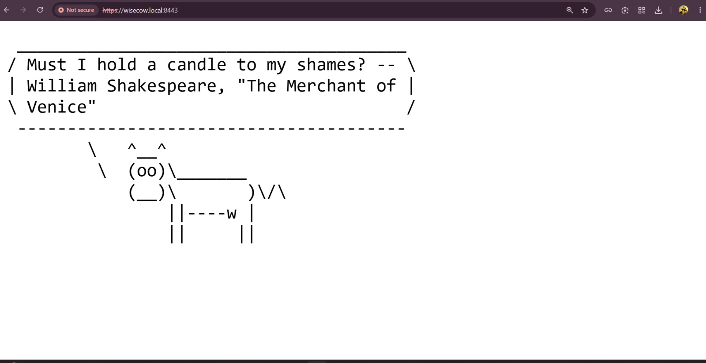
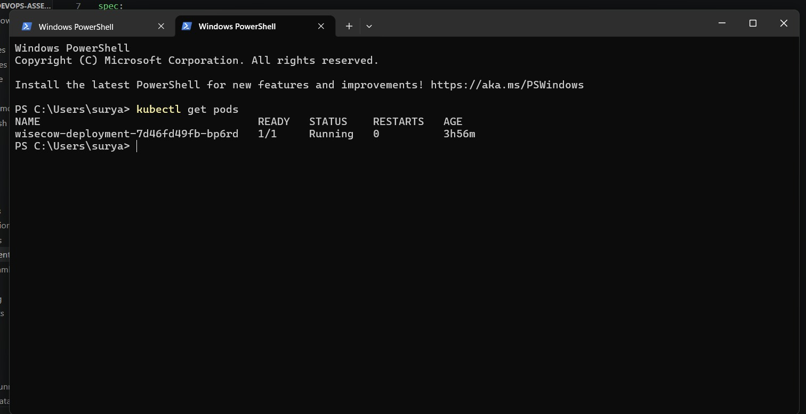
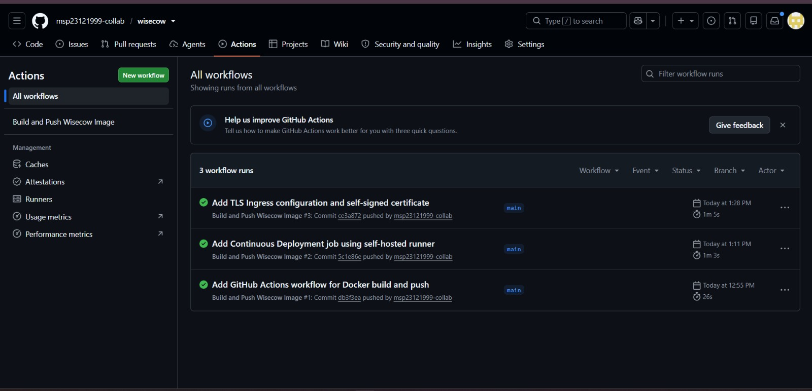
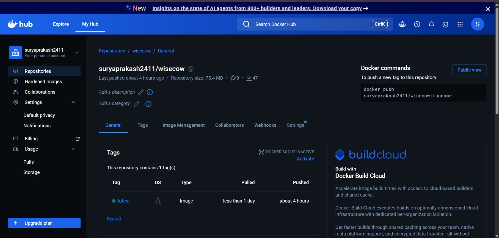

# Wisecow on Kubernetes

This project takes a small app called **Wisecow** and runs it inside containers and Kubernetes, with everything automated and secured. It was built for the AccuKnox DevOps Trainee Practical Assessment.

---

## What does Wisecow do?

Wisecow is a tiny script. Every time you visit it in a browser, it shows you a random quote, drawn inside ASCII cow art. That's it — it's just a fun little app used to practice DevOps skills on.

```
< One of the most striking differences between a cat and a   >
< lie is that a cat has only nine lives. -- Mark Twain        >
       \   ^__^
        \  (oo)\_______
           (__)\       )\/\
               ||----w |
               ||     ||
```

---

## What I built, in simple terms

1. **A Docker container** for Wisecow — so it can run the same way on any computer, not just mine.
2. **Kubernetes files** that tell Kubernetes how to run that container and make it reachable.
3. **A GitHub Actions pipeline** — every time I push new code to GitHub, it automatically:
   - Builds a new container image
   - Pushes it to Docker Hub (a public storage place for container images)
   - Deploys the new version to my Kubernetes cluster
4. **HTTPS (TLS)** — so traffic to the app is encrypted, not plain text.

---

## See it working — Screenshots

### The app running over HTTPS in a browser


### The app running inside Kubernetes


### The automated pipeline succeeding on GitHub


### The container image published on Docker Hub


---

## Project files

```
wisecow/
├── wisecow.sh                          → the original app (not written by me)
├── Dockerfile                          → instructions to build the container
├── kubernetes/
│   ├── deployment.yaml                 → tells Kubernetes to run the app
│   ├── service.yaml                    → makes the app reachable
│   └── ingress.yaml                    → adds HTTPS (TLS) on top
├── certificates/
│   └── tls.crt                         → the public part of the HTTPS certificate
├── screenshots/                        → proof it all works
└── .github/workflows/
    └── docker-build-push.yaml          → the automation (CI/CD)
```

---

## How to try it yourself

**Option 1 — Just run the container:**
```bash
docker pull suryaprakash2411/wisecow:latest
docker run -d -p 4499:4499 suryaprakash2411/wisecow:latest
```
Then open `http://localhost:4499` in a browser.

**Option 2 — Run it on your own Kubernetes cluster:**
```bash
kubectl apply -f kubernetes/deployment.yaml
kubectl apply -f kubernetes/service.yaml
kubectl port-forward service/wisecow-service 4499:4499
```
Then open `http://localhost:4499` in a browser.

---

## Two small problems I had to fix (and how)

While building the Docker image, two things broke the app, and I had to figure out why:

1. **The script wouldn't run at all.** Turned out Windows saves text files slightly differently than Linux (extra invisible characters at the end of each line). I added one line to the Dockerfile to clean this up automatically:
   ```dockerfile
   RUN sed -i 's/\r$//' wisecow.sh
   ```

2. **The app ran, but showed "No fortunes found."** The package that generates the quotes was installed, but the actual *list* of quotes was a separate package I'd forgotten. Adding `fortunes-min` to the Dockerfile fixed it.

---

## How the automation (CI/CD) works

Every time I push code to GitHub, two things happen automatically, one after the other:

1. **Build & Push** — GitHub builds a fresh container image and uploads it to Docker Hub.
2. **Deploy** — A small program running on my own computer (called a "self-hosted runner") notices the new image and tells my Kubernetes cluster to update.

**A note about the second step:** because it deploys to a Kubernetes cluster running on my personal laptop, that exact cluster isn't something anyone else can see over the internet — it only exists while my laptop and that program are running. This is normal for a local learning setup. Anyone reviewing this project can still:
- See the automation succeed, with full logs, in the **Actions** tab on GitHub
- Pull the exact image I built and run it themselves
- Apply my Kubernetes files to their own cluster and see it work the same way

In a real company setting, this last step would instead deploy to a cloud-based cluster that anyone could reach — the same commands would just point somewhere public instead of my laptop.

---

## How the HTTPS (TLS) part works

Wisecow itself doesn't know how to handle HTTPS — it's a very simple script. So instead, I put something called an **Ingress Controller** in front of it, which handles the HTTPS part and passes plain traffic through to Wisecow behind the scenes.

I created my own certificate (the file that makes HTTPS possible) using a tool called OpenSSL, since I don't own a real public website domain for this project. Because of that, browsers will show a **"Not secure"** warning when visiting it.

**This warning does not mean the connection is unsafe** — the traffic really is encrypted. It just means the certificate wasn't issued by one of the big trusted companies (like the ones real websites use), since I made it myself for testing. This is completely normal and expected for a personal/learning project like this one. A real company would instead use a free, trusted certificate service called **Let's Encrypt** through a tool called `cert-manager`.

---

## Credit

The original Wisecow app was written by [nyrahul](https://github.com/nyrahul/wisecow). Everything else (Docker, Kubernetes, automation, HTTPS) was built by me for this assessment.