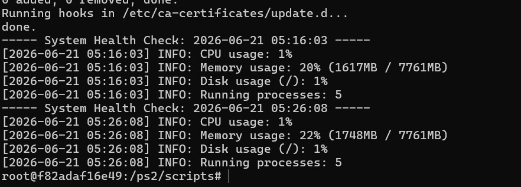
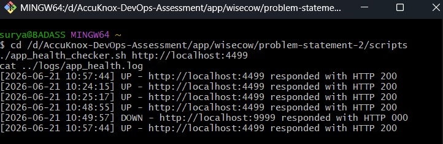
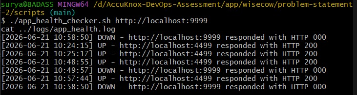

# Problem Statement 2 — Two Health-Check Scripts

This folder contains two small Bash scripts. Both are terminal tools — they don't open a website or have any visual interface. You run them, they check something, and they print and save the result. That's it.

I picked these two from the four options given:
1. ✅ System Health Monitoring Script
2. ✅ Application Health Checker

---

## Script 1 — System Health Monitor

**What it does:** Checks the computer's CPU usage, memory (RAM) usage, disk space, and how many processes are currently running. If CPU, memory, or disk usage goes above 80%, it writes a clear **ALERT** line so it stands out from normal readings.

**File:** `scripts/system_health_monitor.sh`
**Log file it writes to:** `logs/system_health.log`

### How to run it

This script uses real Linux tools (`top`, `free`), so it needs to run on an actual Linux machine — or a Linux container, since I built this on Windows:

```bash
docker run --rm -it -v $(pwd):/ps2 ubuntu bash
apt-get update && apt-get install -y curl bc procps
cd /ps2/scripts
./system_health_monitor.sh
cat /ps2/logs/system_health.log
```

### Example output

```
----- System Health Check: 2026-06-21 05:16:03 -----
[2026-06-21 05:16:03] INFO: CPU usage: 1%
[2026-06-21 05:16:03] INFO: Memory usage: 20% (1617MB / 7761MB)
[2026-06-21 05:16:03] INFO: Disk usage (/): 1%
[2026-06-21 05:16:03] INFO: Running processes: 5
```

If any value goes over 80%, you'd see a line like this instead, which also prints straight to the screen (not just the log file):
```
[2026-06-21 05:16:03] ALERT: CPU usage is high: 92% (threshold: 80%)
```

---

## Script 2 — Application Health Checker

**What it does:** Visits a web address and checks the HTTP status code it gets back. If the code means "success" (200–399), it reports **UP**. If the address doesn't respond properly, it reports **DOWN**.

**File:** `scripts/app_health_checker.sh`
**Log file it writes to:** `logs/app_health.log`

### How to run it

This one only needs `curl`, so it runs anywhere — no container needed. I tested it against my own Wisecow app from Problem Statement 1.

```bash
./app_health_checker.sh http://localhost:4499
cat ../logs/app_health.log
```

You can check any address by changing the link, for example:
```bash
./app_health_checker.sh https://google.com
```

### Example output — a working site (UP)

```
[2026-06-21 10:48:55] UP - http://localhost:4499 responded with HTTP 200
```

### Example output — a site that isn't responding (DOWN)

```
[2026-06-21 10:49:57] DOWN - http://localhost:9999 responded with HTTP 000
```
(`HTTP 000` means it couldn't even connect — nothing was listening on that address at all.)

---

## A small problem I ran into (and what it taught me)

Both scripts gave a strange error the first time I ran them on Linux:
```
line 1: #!/bin/bash: No such file or directory
```

I'd already fixed the usual Windows line-ending problem (the same one I hit back in Problem Statement 1), but the error was still there. Digging deeper with `cat -A`, I found there were 3 invisible characters at the very start of the file — something called a **byte-order mark (BOM)**, which the tool I used to create the file on Windows had silently added. Linux doesn't expect this and couldn't recognize the script's first line properly because of it.

Fixed with:
```bash
sed -i '1s/^\xEF\xBB\xBF//' system_health_monitor.sh
```

Worth remembering: two completely different invisible-character problems (line endings *and* this BOM issue) can both produce a very similar-looking error, so it's worth checking carefully rather than assuming it's always the same fix.

---

## Screenshots — proof both scripts work

### System Health Monitor — real output


### App Health Checker — detecting the app is UP


### App Health Checker — correctly detecting DOWN too


---

## Folder layout

```
problem-statement-2/
├── scripts/
│   ├── system_health_monitor.sh
│   └── app_health_checker.sh
├── logs/
│   ├── system_health.log
│   └── app_health.log
├── screenshots/
│   ├── system-health-monitor-output.jpg
│   ├── app-health-checker-up.jpg
│   └── app-health-checker-down.jpg
└── README.md
```