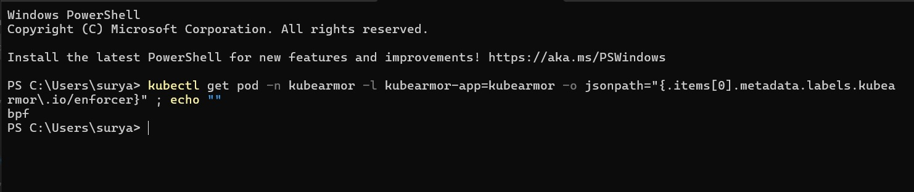
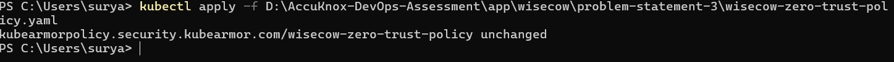
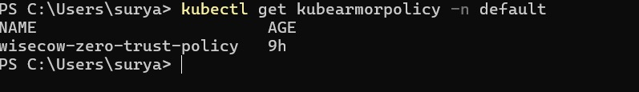
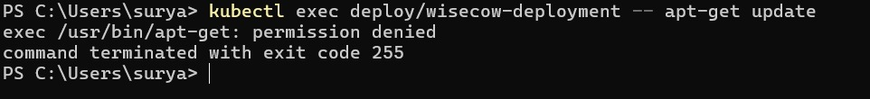
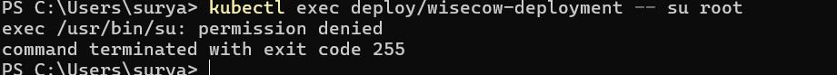
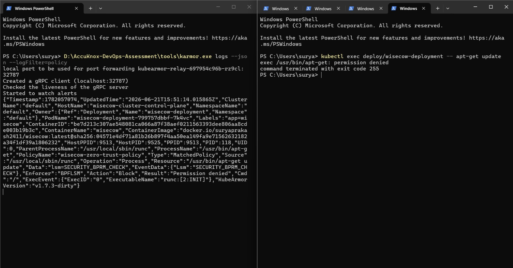
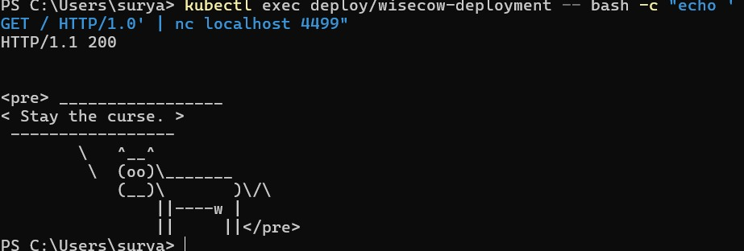

# 🛡️ Problem Statement 3 — Zero Trust KubeArmor Policy

> **AccuKnox DevOps Trainee Practical Assessment**

This section demonstrates the implementation of a **Zero Trust security policy** using [KubeArmor](https://kubearmor.io/) on the Wisecow Kubernetes workload. The policy blocks dangerous binaries inside the container, captures real policy violations, and proves that the application continues to run normally.

---

## 🎯 Objective

### What is Zero Trust?

**Zero Trust** is a security model where nothing is trusted by default — not even processes running inside your own containers. Every action must be explicitly allowed. Anything that is not needed for the application to work is **blocked**.

### What is KubeArmor?

**KubeArmor** is an open-source runtime security engine for Kubernetes. It uses **Linux Security Modules (LSM)** to enforce security policies at the kernel level. It can:

- **Block** unauthorized process execution inside containers.
- **Block** access to sensitive files.
- **Generate alerts** when a policy violation occurs.

### Assessment Requirement

1. Write a Zero Trust KubeArmor policy.
2. Apply it to the Wisecow Kubernetes workload.
3. Trigger and capture real policy violations.
4. Commit the policy YAML and screenshots as evidence.

---

## 📁 Project Structure

```
problem-statement-3/
├── README.md                                  # This file
├── wisecow-zero-trust-policy.yaml             # The KubeArmor policy
└── screenshots/
    ├── 01-kubearmor-bpf-enforcer.png          # Enforcer = BPF
    ├── 02-policy-applied.png                  # Policy applied successfully
    ├── 03-policy-list.png                     # Policy exists in Kubernetes
    ├── 04-apt-get-blocked.png                 # apt-get blocked
    ├── 05-su-blocked.png                      # su blocked
    ├── 06-kubearmor-logs.png                  # KubeArmor violation alert
    └── 07-application-running.png             # App still healthy
```

---

## 🖥️ Environment

| Component | Details |
|---|---|
| **Host OS** | Windows 11 |
| **Linux Subsystem** | WSL2 (kernel `6.18.33.1-microsoft-standard-WSL2`) |
| **Container Engine** | Docker Desktop |
| **Kubernetes** | KinD (Kubernetes in Docker) — `v1.34.0` |
| **Container Runtime** | containerd `2.1.3` |
| **Security Engine** | KubeArmor `v1.7.3` |
| **Enforcer** | BPF-LSM |
| **KubeArmor CLI** | karmor `v1.4.7` |

---

## 🔍 Root Cause — Why the Policy Was Not Working Initially

When KubeArmor was first installed, the policy was **loaded but never enforced**.

### The Problem

The KubeArmor agent pod showed:

```
kubearmor.io/enforcer: none
```

This means KubeArmor could **see** the policy but could **not block** anything. It was running in audit-only mode.

### Why This Happened

KubeArmor needs a **Linux Security Module (LSM)** to enforce policies at the kernel level. On WSL2, the default kernel has BPF-LSM **compiled** but **not enabled** in the boot parameters. Without an active LSM, KubeArmor has no mechanism to intercept and block system calls.

| Check | Before Fix | After Fix |
|---|---|---|
| **Active LSMs** | `capability,landlock,yama,safesetid,selinux,ima` | `capability,bpf,ima` |
| **KubeArmor Enforcer** | `none` | `bpf` |
| **Policy Enforcement** | ❌ Audit only | ✅ Active blocking |

---

## ✅ Solution — How the Issue Was Fixed

### Step 1: Enable BPF-LSM in WSL2

Created a file at `C:\Users\surya\.wslconfig` with the following contents:

```ini
[wsl2]
kernelCommandLine=lsm=bpf
```

This tells the WSL2 kernel to enable the BPF Linux Security Module at boot time.

### Step 2: Restart WSL

```powershell
wsl --shutdown
```

This restarts the WSL2 virtual machine so the new kernel parameter takes effect.

### Step 3: Restart KubeArmor

```bash
kubectl delete pods -n kubearmor -l kubearmor-app=kubearmor
```

This forces the KubeArmor agent to restart and re-detect the newly available BPF-LSM enforcer.

### Step 4: Verify the Enforcer

```bash
kubectl get pod -n kubearmor -l kubearmor-app=kubearmor -o jsonpath="{.items[0].metadata.labels.kubearmor\.io/enforcer}"
```

**Output:** `bpf`

The enforcer changed from `none` to `bpf`. KubeArmor can now actively block unauthorized actions.

---

## 📜 Zero Trust Policy

### The Policy File

**File:** [`wisecow-zero-trust-policy.yaml`](wisecow-zero-trust-policy.yaml)

```yaml
apiVersion: security.kubearmor.com/v1
kind: KubeArmorPolicy
metadata:
  name: wisecow-zero-trust-policy
  namespace: default
spec:
  selector:
    matchLabels:
      app: wisecow
  process:
    matchPaths:
      - path: /usr/bin/apt
      - path: /usr/bin/apt-get
      - path: /usr/bin/dpkg
      - path: /usr/bin/su
    action: Block
  file:
    matchDirectories:
      - dir: /root/
        recursive: true
    matchPaths:
      - path: /etc/shadow
    action: Block
```

### What Does This Policy Block?

| Blocked Binary/Path | Type | Why It Is Blocked |
|---|---|---|
| `/usr/bin/apt` | Process | Package manager — an attacker could install malicious tools |
| `/usr/bin/apt-get` | Process | Package manager — same risk as `apt` |
| `/usr/bin/dpkg` | Process | Low-level package installer — bypasses apt to install `.deb` files |
| `/usr/bin/su` | Process | Privilege escalation — allows switching to the root user (has SUID bit) |
| `/root/` | File (directory) | Root user's home directory — sensitive configuration files |
| `/etc/shadow` | File | Contains hashed passwords — an attacker could dump credentials |

### Why Are Application Binaries NOT Blocked?

The Wisecow application is a Bash script that uses these binaries to run:

| Binary | Used For | Blocked? |
|---|---|---|
| `/usr/bin/bash` | Runs the main script | ❌ Not blocked — required |
| `/usr/bin/nc` | Listens for HTTP connections on port 4499 | ❌ Not blocked — required |
| `/usr/games/cowsay` | Generates the cow ASCII art | ❌ Not blocked — required |
| `/usr/games/fortune` | Generates random quotes | ❌ Not blocked — required |
| `/usr/bin/cat` | Reads the response file | ❌ Not blocked — required |
| `/usr/bin/sleep` | Adds a small delay between requests | ❌ Not blocked — required |

> **Zero Trust Principle:** Block what is dangerous. Allow only what is necessary.

---

## 🚀 Applying the Policy

### Command 1 — Apply the policy to the cluster

```bash
kubectl apply -f wisecow-zero-trust-policy.yaml
```

This creates the KubeArmorPolicy resource in the `default` namespace and tells KubeArmor to start enforcing it on all pods with the label `app=wisecow`.

### Command 2 — Verify the policy exists

```bash
kubectl get kubearmorpolicy -n default
```

This lists all KubeArmor policies in the `default` namespace.

**Output:**

```
NAME                        AGE
wisecow-zero-trust-policy   9h
```

### Command 3 — Verify the policy was loaded by KubeArmor

```bash
kubectl logs -n kubearmor daemonset/kubearmor-bpf-containerd-98c2c -c kubearmor | Select-String "wisecow-zero-trust-policy"
```

This searches the KubeArmor agent logs for any mention of our policy.

**Output:**

```
2026-06-21 15:07:08  INFO  Detected a Security Policy (added/default/wisecow-zero-trust-policy)
2026-06-21 15:12:09  INFO  Detected a Security Policy (modified/default/wisecow-zero-trust-policy)
```

KubeArmor successfully detected and loaded the policy.

---

## 🧪 Testing the Policy

### Test 1 — Block `apt-get update`

```bash
kubectl exec deploy/wisecow-deployment -- apt-get update
```

This tries to run the `apt-get` package manager inside the Wisecow container.

**Expected Result:** Blocked by KubeArmor.

**Actual Output:**

```
exec /usr/bin/apt-get: permission denied
command terminated with exit code 255
```

✅ **Blocked.**

---

### Test 2 — Block `apt update`

```bash
kubectl exec deploy/wisecow-deployment -- apt update
```

This tries to run the `apt` package manager.

**Actual Output:**

```
exec /usr/bin/apt: permission denied
command terminated with exit code 255
```

✅ **Blocked.**

---

### Test 3 — Block `su root`

```bash
kubectl exec deploy/wisecow-deployment -- su root
```

This tries to escalate privileges to the root user.

**Actual Output:**

```
exec /usr/bin/su: permission denied
command terminated with exit code 255
```

✅ **Blocked.**

---

## 🚨 Policy Violations

All three blocked commands triggered KubeArmor security alerts.

| # | Command | Process | Action | Result |
|---|---|---|---|---|
| 1 | `apt-get update` | `/usr/bin/apt-get` | Block | Permission denied |
| 2 | `apt update` | `/usr/bin/apt` | Block | Permission denied |
| 3 | `su root` | `/usr/bin/su` | Block | Permission denied |

Each violation was intercepted at the kernel level by the `SECURITY_BPRM_CHECK` LSM hook before the process could start.

---

## 📊 KubeArmor Logs

The violation alerts were captured using the `karmor` CLI:

```bash
karmor logs --json --logFilter=policy
```

### Sample Alert (apt-get update)

| Field | Value |
|---|---|
| **Timestamp** | `2026-06-21T15:21:56.108232Z` |
| **PodName** | `wisecow-deployment-799757dbbf-7k4vc` |
| **ContainerName** | `wisecow` |
| **Labels** | `app=wisecow` |
| **ProcessName** | `/usr/bin/apt-get` |
| **PolicyName** | `wisecow-zero-trust-policy` |
| **Type** | `MatchedPolicy` |
| **Operation** | `Process` |
| **Resource** | `/usr/bin/apt-get update` |
| **Enforcer** | `BPFLSM` |
| **Action** | `Block` |
| **Result** | `Permission denied` |
| **LSM Hook** | `SECURITY_BPRM_CHECK` |

These logs prove that:
- ✅ The correct policy (`wisecow-zero-trust-policy`) was matched.
- ✅ The correct process (`/usr/bin/apt-get`) was intercepted.
- ✅ The enforcer (`BPFLSM`) actively blocked the execution.
- ✅ The result was `Permission denied` — a real enforcement, not just an audit.

---

## 💚 Application Verification

After enforcing the Zero Trust policy, the Wisecow application was verified to be running normally:

```bash
kubectl get pod -l app=wisecow
```

**Output:**

```
NAME                                  READY   STATUS    RESTARTS   AGE
wisecow-deployment-799757dbbf-7k4vc   1/1     Running   2          9h
```

The application was also tested to confirm it still serves HTTP responses:

```bash
kubectl exec deploy/wisecow-deployment -- bash -c "echo 'GET / HTTP/1.0' | nc localhost 4499"
```

**Output:** HTTP 200 response with cowsay ASCII art — the application works perfectly.

> The policy blocks only dangerous binaries. The application binaries are untouched.

---

## 📸 Screenshots

### Screenshot 1 — KubeArmor Enforcer Using BPF

**What it shows:** The KubeArmor agent pod has the label `kubearmor.io/enforcer: bpf`, confirming that BPF-LSM enforcement is active (not `none`).



---

### Screenshot 2 — Policy Successfully Applied

**What it shows:** The `kubectl apply` command successfully configured the Zero Trust policy in the Kubernetes cluster.



---

### Screenshot 3 — Policy Verification

**What it shows:** The `kubectl get kubearmorpolicy` command confirms the policy exists in the `default` namespace.



---

### Screenshot 4 — Blocked `apt-get` Command

**What it shows:** Running `apt-get update` inside the Wisecow container returns `permission denied`. KubeArmor blocked the package manager.



---

### Screenshot 5 — Blocked `su` Command

**What it shows:** Running `su root` inside the Wisecow container returns `permission denied`. Privilege escalation is denied.



---

### Screenshot 6 — KubeArmor Violation Logs

**What it shows:** The `karmor logs` command displays a structured JSON alert containing the policy name, blocked process, enforcer type (BPFLSM), action (Block), and result (Permission denied).



---

### Screenshot 7 — Wisecow Application Running

**What it shows:** The Wisecow application pod is still in `Running` state with `1/1` containers ready. The policy did not break the application.



---

## 📚 Learning Outcomes

- 🔐 Learned what **Zero Trust** means — block everything that is not explicitly needed.
- 🛡️ Learned how **KubeArmor** enforces security policies at the Linux kernel level using LSM hooks.
- ⚙️ Learned that KubeArmor needs an active **Linux Security Module** (like BPF-LSM or AppArmor) to enforce policies — without one, it can only audit.
- 🐧 Learned how to enable **BPF-LSM** on WSL2 by configuring `.wslconfig` kernel boot parameters.
- 📝 Learned how to write a **KubeArmorPolicy** YAML that selects pods by label and blocks specific process paths and file paths.
- 🧪 Learned how to **trigger and capture** real policy violations using `kubectl exec` and `karmor logs`.
- 🔍 Learned how to analyze **structured JSON alerts** from KubeArmor to verify enforcement details (policy name, enforcer, action, result).
- 🏗️ Learned the importance of **not blocking application dependencies** — a Zero Trust policy must understand what the application actually needs to run.
- 📊 Learned how to verify that a security policy is **loaded and active** by checking KubeArmor agent logs.
- 🚀 Learned how to use `karmor` CLI to stream real-time security alerts from the KubeArmor relay service.

---

## ✅ Conclusion

I successfully implemented a **Zero Trust KubeArmor security policy** for the Wisecow Kubernetes workload as part of the AccuKnox DevOps Trainee Practical Assessment.

**What was achieved:**

- ✅ Diagnosed and fixed the root cause (`enforcer: none` → `enforcer: bpf`) by enabling BPF-LSM on WSL2.
- ✅ Wrote a Zero Trust policy that blocks package managers (`apt`, `apt-get`, `dpkg`), privilege escalation (`su`), and sensitive file access (`/etc/shadow`, `/root/`).
- ✅ Applied the policy to the Wisecow workload without breaking the application.
- ✅ Triggered **three real policy violations** and captured structured JSON alerts from KubeArmor.
- ✅ Verified that all blocked commands returned `Permission denied` at the kernel level via BPF-LSM.
- ✅ Confirmed the application remained fully functional after policy enforcement.

> **The container is hardened. The application is safe. The evidence is captured.**

---

<p align="center">
  <b>Built with 🛡️ KubeArmor + ☸️ Kubernetes + 🐧 BPF-LSM</b>
</p>
